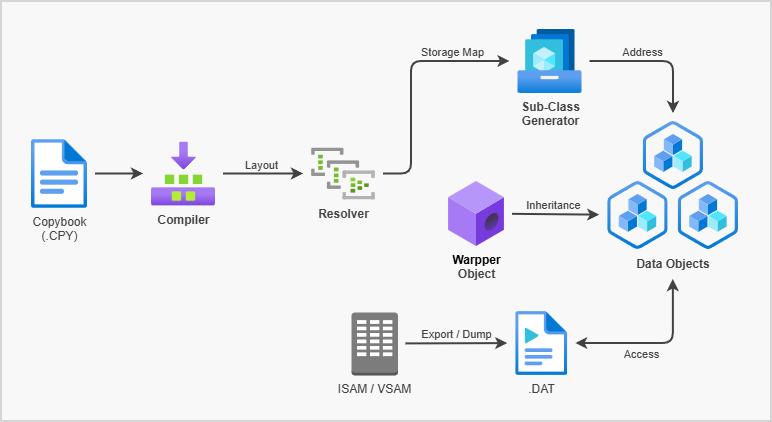
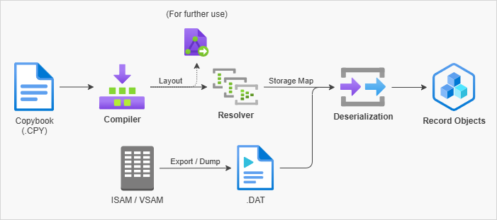
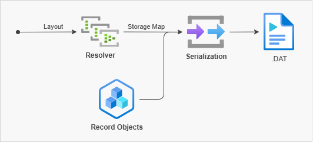
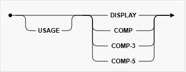

# Get The Picture
Modern .NET library for working with COBOL Copybook–based data  
用於處理以 COBOL Copybook 為基礎資料的現代 .NET 類別庫  

> **讀懂你 COBOL 的明白**  

## 開發需求
- **.NET 8.0** 或更新版本
- **C# 12** 或相容版本（.NET 8 預設）

## 輸入格式需求
- COBOL Copybook (`.cpy`) 純文字檔案
- ASCII / CP950 編碼

<br><br>

# 專案目的
> 透過簡單的文字 `X` 與數字 `9 / S9`，我們建構出長達百年的金融體系。  

<br>

<details>
    <summary>TL;DR</summary>

COBOL 的 `PICTURE` 子句，以極少的符號，精確地描述出資料的**型態、長度、符號位、顯示格式與儲存語意**。
這套設計方式歷經數十年的實務驗證，支撐了銀行、保險、政府與大型企業的核心系統，至今仍在持續運作。

<br>

然而，在現代語言（例如C#、Java、TypeScript、Rust）中，這些語意往往被**隱含、分散或遺失**：

* `string` 與 `number` 無法完整表達 **定長、補零、符號位置、顯示與儲存差異**
* 解析邏輯常以 ad-hoc 的 `TryParse`、正則或硬編碼規則存在
* PIC 與現代型別之間缺乏**可驗證、可測試、可組合**的轉換模型

<br>

本專案的目的，是將 `COBOL PICTURE` 子句視為一種 **明確的資料規格（Data Specification）**，並：

### 將 PIC 語意轉換為可映射的現代資料模型

* 明確區分 **顯示格式（DISPLAY）** 與 **實際數值語意**
* 將 `9 / S9 / V / X / A` 等元素拆解為結構化資訊
* 建立可對應至現代語言型別（`int / long / decimal / string` 等）的判斷依據

### 建立可組合、可擴充的 Decode / Encode 流程

* 以 **Fluent / Builder 風格**描述解析上下文
* 將「字串 → 型別」與「型別 → 字串」視為對等的一階公民
* 讓轉換過程可被單元測試、驗證與重構

</details>

### 降低 COBOL 與現代系統整合的心智與實作成本

* 避免重複撰寫易出錯的解析邏輯
* 提供一致、可預期的行為邊界（精度、符號）
* 作為資料轉換、系統汰換、或雙軌運行的一部分


### 保留歷史系統的「語意」，而不只是資料

⚠️ 本專案不試圖「現代化」COBOL語言，而是**尊重並保存其資料設計哲學**，使其能被現代語言理解、驗證與安全地使用。

<br>

## 適用情境

* 核心系統資料轉出
* COBOL 與現代服務的資料交換層
* 舊系統重構或漸進式汰換
* 對 PIC 規格進行靜態分析或測試驗證

<br><br>

# COBOL Copybook
`Copybook` 是 COBOL 中用來定義資料結構的重用檔案，透過 COPY 指令引入，常用於描述檔案格式、資料欄位配置與記憶體布局。在大型主機與金融系統中，Copybook 是資料交換與系統整合的核心。  

Copybook 通常包含：
- 欄位階層（Level Number）
- 資料型別與長度（PIC 子句）
- 儲存格式（如 DISPLAY、COMP、COMP-3）

由於 Copybook 直接對應到位元與位元組配置，它不僅是程式碼的一部分，更是系統間共用的資料規格說明書。  

<br>

## Copybook Warpper

Copybook Warpper 是一個 Raw Buffer 層級的存取工具。提供**欄位級別抽象存取**，不需要傳統的 DTO 或序列化/反序列化過程。

  

Warpper vs SerDes  
| 功能         | SerDes       | Warpper                      |
| ---------- | --------------- | ------------------------------- |
| Raw ↔ 物件   | Yes, 一次性 DTO    | 不需要 DTO，直接欄位級存取                 |
| 欄位抽象化      | No / 需要 mapping | Yes，靠 `CbAddress` + indexer/屬性 |
| Memory 複製  | 全部複製            | 幾乎零複製，Span 直接操作 Raw             |
| 動態欄位讀寫     | 一般不方便           | 內建 indexer 或強型別屬性               |
| 物件圖 / 狀態管理 | Yes             | No，Raw 是唯一來源                    |

<br>

### 使用方式
資料物件需**繼承**核心物件 `CbWarpper`，根據 Copybook 定義，透過 `CbAddress` 設定每個欄位的起始位置、長度及格式。  
- 可透過 indexer 或 **強型別屬性**存取欄位
- 支援即時驗證 Raw Buffer 長度是否符合欄位配置

<br>

- 程式碼範例：櫃買中心 T30 漲跌幅度資料
    ```csharp
    const string s = "11011 00106600000096950000087300020251219000000  0台泥一永        000000000000000000000 0           ";

    byte[] raw = cp950.GetBytes(s);
            
    var T30 = new T30_t(raw);

    Console.WriteLine(T30.StockNo);   // "11011"
    Console.WriteLine(T30.BullPrice); // 106.6m
    Console.WriteLine(T30.StockName); // "台泥一永"
    ```

    <br>

    <details>
        <summary>T30_t</summary>

    ```csharp
    public class T30_t(byte[] raw) : CbWarpper(raw)
    {
        // ----------------------------
        // Copybook Address Map
        // ----------------------------

        protected override Dictionary<string, CbAddress> AddressMap { get; } = new Dictionary<string, CbAddress>
        {
            ["STOCK-NO"]      = new CbAddress( 1, 6, "X(6)"),
            ["BULL-PRICE"]    = new CbAddress( 7, 9, "9(5)V9(4)"),
            ["LDC-PRICE"]     = new CbAddress(16, 9, "9(5)V9(4)"),
            ["BEAR-PRICE"]    = new CbAddress(25, 9, "9(5)V9(4)"),
            ["LAST-MTH-DATE"] = new CbAddress(34, 8, "9(8)"),
            ["SETTYPE"]       = new CbAddress(42, 1, "X(01)"),
            ["MARK-W"]        = new CbAddress(43, 1, "X(01)"),
            ["MARK-P"]        = new CbAddress(44, 1, "X(01)"),
            ["MARK-L"]        = new CbAddress(45, 1, "X(01)"),
            ["IND-CODE"]      = new CbAddress(46, 2, "X(02)"),
            ["IND-SUB-CODE"]  = new CbAddress(48, 2, "X(02)"),
            ["MARK-M"]        = new CbAddress(50, 1, "X(01)"),
            ["STOCK-NAME"]    = new CbAddress(51,16, "X(16)"),
            // MARK-W
                ["MATCH-INTERVAL"] = new CbAddress(67, 3, "9(03)"),
                ["ORDER-LIMIT"]    = new CbAddress(70, 6, "9(06)"),
                ["ORDERS-LIMIT"]   = new CbAddress(76, 6, "9(06)"),
                ["PREPAY-RATE"]    = new CbAddress(82, 3, "9(03)"),
            ["MARK-S"]        = new CbAddress(85, 1, "X(01)"),
            ["STK-MARK"]      = new CbAddress(86, 1, "X(01)"),
            ["MARK-F"]        = new CbAddress(87, 1, "X(01)"),
            ["MARK-DAY-TRADE"]= new CbAddress(88, 1, "X(01)"),
            ["STK-CTGCD"]     = new CbAddress(89, 1, "X(01)"),
            ["FILLER"]        = new CbAddress(90,11, "X(11)"),
        };

        // ----------------------------
        // 強型別屬性
        // ----------------------------

        public string StockNo
        {
            get => (string)this["STOCK-NO"]!;
            set => this["STOCK-NO"] = value;
        }

        public decimal BullPrice
        {
            get => (decimal)this["BULL-PRICE"]!;
            set => this["BULL-PRICE"] = value;
        }

        public decimal LdcPrice
        {
            get => (decimal)this["LDC-PRICE"]!;
            set => this["LDC-PRICE"] = value;
        }

        public decimal BearPrice
        {
            get => (decimal)this["BEAR-PRICE"]!;
            set => this["BEAR-PRICE"] = value;
        }

        // (略...)
    }
    ```

    </details>

<br>

📖 更多關於 [Copybook Compiler](docs/get-the-picture/copybook/compiler.md) ...  
📖 更多關於 [Copybook Resolver](docs/get-the-picture/copybook/resolver.md) ...  

<br><br>

## Copybook SerDes (⚠️Obsolete)
SerDes 是 `Serialization`（序列化）與 `Deserialization`（反序列化）的合稱，用於資料在不同系統或存儲之間的轉換。  

<br>

1. Deserialization（反序列化）  
    將序列化後的資料恢復成程式中的 `物件` 或 `資料結構` (目前採用Dictionary)。 

      

    ```csharp
    // 提供 Copybook 的 layout 與 storage
    var provider = new DataProvider(new StreamReader(@"TestData/t30-otc.cpy", cp950));

    // 建立 Serializer/Deserializer
    var serDes = new CbSerDes(provider);

    // 讀取檔案 (編碼: CP950 / ASCII)
    using var reader = new StreamReader(@"TestData/t30-otc-lite.dat", cp950);

    string? line;
    while ((line = reader.ReadLine()) != null)
    {
        var byte = cp950.GetBytes(line);

        // 根據Copybook的資料格式來反序列化 (Deserialize) 資料
        CbRecord record = serDes.Deserialize(expected);

        Console.WriteLine("==== Record ====");
        record.Print();
        Console.WriteLine("================\n");
    }
    ```

    <details>
        <summary>輸出結果：</summary>

    ```shell
    ...
    ==== Record ====
    STOCK-NO: 19094
    BULL-PRICE: 105.80000
    LDC-PRICE: 96.20000
    BEAR-PRICE: 86.60000
    LAST-MTH-DATE: 20251111
    SETTYPE: 0
    MARK-W: 0
    MARK-P: 0
    MARK-L: 0
    IND-CODE: 00
    IND-SUB-CODE: 
    MARK-M: 0
    STOCK-NAME: 榮成四
    MARK-W-DETAILS:
    MATCH-INTERVAL: 0
    ORDER-LIMIT: 0
    ORDERS-LIMIT: 0
    PREPAY-RATE: 0
    MARK-S: 0
    STK-MARK: 0
    MARK-F: 0
    MARK-DAY-TRADE: 
    STK-CTGCD: 0
    ================
    ...
    ```
        
    </details>

    <br>

    > ⚠️ 目前不支援包含 `Level 66`、`Level 77`、`REDEFINES` 子句的反序列化處裡  

<br>

2. Serialization（序列化）  
    將程式中的物件或資料結構轉換成一種 `可存儲` 或 `傳輸` 的格式。  

      

    ```csharp
    var serialized = serDes.Serialize(record);
    ```

<br>

**SerDes** 的相關使用範例位於 [CbSerDesTest.cs](GetThePicture.Tests/Copybook/SerDes/CbSerDesTest.cs) 內有標記 `[TestCategory("Demo")]` 的測試項目中。

<br>

## Level 66 (`RENAMES … THRU`) in Copybook
目前僅解析並保留位於 record 末端的 Level 66 `RENAMES … THRU` 定義。此類 Level 66 不影響實體儲存結構，僅表達既有欄位的語意聚合，適合作為語意資訊保存。常用於描述**類似 RECORD KEY 的邏輯識別範圍（logical key）**。  

此限制確保被 `RENAMES` 涵蓋的欄位範圍為線性、連續且可預期，並降低解析複雜度。同時為未來進行語意型態轉換或資料庫 DDL 投影預留擴充空間。

<br>

📖 更多關於 [RECORD KEY Clause](docs/get-the-picture/copybook/record-key-clause.md) ...  

<br><br>

# COBOL Coding Sheet (Reference Format)
COBOL 程式有一套固定的欄位規則，尤其在 `固定格式（Fixed Format）` 下很重要。主要分為 `Sequence Area`, `Indicator Area`, `Area A`, `Area B` 等區域。

<br>

```cobol
|...+.*..1....+....2....+....3....+....4....+....5....+....6....+....7..
       01 ORDER-RECORD.
           05 ORDER-ID           PIC 9(6).
           05 ORDER-DATE         PIC 9(8).
           05 ORDER-AMOUNT       PIC S9(7)V99 COMP-3.
```

<br>

| 位置 (Column) | 說明                                                                 |
| ----------- | ------------------------------------------------------------------ |
| 1–6         | **Sequence Number**（序號欄，可選）：用於列印或版本控制。                             |
| 7           | **Indicator Area**（指示欄）：<br> - `*`：註解<br> - `/`：換頁<br> - `-`：延續上一行 |
| 8–11        | **Area A**：段落名稱、Section 名稱、DIVISION 關鍵字等。                          |
| 12–72       | **Area B**：語句、指令、變數宣告、程式碼本體。                                       |
| 73–80       | **Identification Area**（識別欄，可選）：通常用於序號或其他控制用途。                     |

> 現代 COBOL `(Free Format) ` 已經不限制欄位，但固定格式仍常用於舊系統。  

<br>

<details>
    <summary>ℹ️ "Elementary Data Item" and "Group Item"</summary>

| 面向                    | Elementary Data Item    | Group Item             |
| --------------------- | ----------------------- | ---------------------- |
| 定義角色                  | **最小資料單位（leaf）**        | **結構性容器（composite）**   |
| 是否可包含子項目              | ❌ 不可                    | ✅ 可                    |
| 是否有 `PIC` 子句          | ✅ **必須有**               | ❌ **不可有**              |
| 是否直接描述資料型態            | ✅ 是（數值、字元、COMP、COMP-3…） | ❌ 否（由子項目間接決定）          |
| 是否可直接被 MOVE / COMPUTE | ✅ 可                     | ⚠️ 可（視情況，為整段記憶體移動）     |
| 記憶體佔用                 | 由 `PIC` 決定              | 為所有子項目記憶體的總和           |
| 可否有 `OCCURS`          | ✅ 可                     | ✅ 可                    |
| 可否有 `REDEFINES`       | ✅ 可                     | ✅ 可                    |
| 可否有 `VALUE`           | ✅ 可                     | ❌（標準上 group 不定義 VALUE） |
| 是否為樹的葉節點              | ✅ 是                     | ❌ 否                    |
| COBOL 規格名稱            | *Elementary data item*  | *Group item*           |

<br>

📖 更多關於 [Elementary Data Item](docs/get-the-picture/cobol/ElementaryDataItem.md) ...  

</details>

<br><br>

# COBOL DATA DIVISION (Data description entry)

用於描述程式中所有資料的結構、型態與儲存方式。

目前支援的修飾子句處理：

**Format 1**  
```
<level-number> <data-name-1>
    [REDEFINES <data-name-2>]
    [PICTURE <character-string>]
    [USAGE <usage-type>]
    [OCCURS <n> TIMES]
    [VALUE <literal-1>].
```

<br>

**Format 2**  
```
66 <data-name-1> RENAMES <data-name-2> THRU <data-name-3>.
```

<br>

**Format 3**  
```
88 <condition-name-1> VALUE[S] <literal-1> [THRU <literal-2>].
```

<br><br>

# Level Numbers

COBOL 使用 `Level Number`（層級號） 來描述資料結構，主要有：

| Level         | 用途             | 說明                  |
| ------------- | -------------- | ------------------- |
| **01**        | 主結構            | 定義檔案或記錄的頂層結構        |
| **05/10/15…** | 子結構            | 01 之下的子群組或欄位，形成巢狀結構 |
| **66**        | RENAMES        | 將已有欄位重新命名或形成別名區段    |
| **77**        | 單一變數           | 不屬於群組，獨立使用          |
| **88**        | Condition Name | 定義邏輯條件（True/False）  |

> ⚠️ Level number 越小層級越高，01 是最外層。

### 詳細說明
- Level [66 — RENAMES](docs/get-the-picture/cobol-level-numbers/lv66.md)
- Level [77 — Standalone Variable (單一變數)](docs/get-the-picture/cobol-level-numbers/lv77.md)
- Level [88 — Condition Name](docs/get-the-picture/cobol-level-numbers/lv88.md)  

<br><br>

# REDEFINES 子句

## 與 `66 RENAMES` 的差異
|            | RENAMES         | REDEFINES       |
| ---------- | --------------- | --------------- |
| 影響 storage | ❌               | ✅               |
| 改變 offset  | ❌               | ✅（對齊另一個）        |
| 本體是        | 邏輯群組            | **GroupItem**   |
| 最終表現       | View / Property | View / Property |

<br>

## 支援說明

在 IBM 提供的 [REDEFINES clause](https://www.ibm.com/docs/en/cobol-linux-x86/1.2.0?topic=entry-redefines-clause) 文件中，整理出幾種 `REDEFINES` 可能的使用與法規則：

<details>
    <summary>CASE 1：Group REDEFINES Elementary Data Item</summary>

    ```cobol
    05  A PICTURE X(6).
    05  B REDEFINES A.
        10 B-1          PICTURE X(2).
        10 B-2          PICTURE 9(4).
    05  C               PICTURE 99V99.

    ```
</details>

<details>
    <summary>CASE 2：01-level + GLOBAL</summary>

    ```cobol
    01 A1 PICTURE X(6). 
    01 B1 REDEFINES A1 GLOBAL PICTURE X(4). 
    ```
</details>

<details>
    <summary>CASE 3：多個 REDEFINES 指向同一 target</summary>

    ```cobol
    05  A               PICTURE 9999.
    05  B REDEFINES A   PICTURE 9V999.
    05  C REDEFINES A   PICTURE 99V99.
    ```
</details>

<details>
    <summary>CASE 4：REDEFINES 鏈</summary>

    ```cobol
    05  A               PICTURE 9999.
    05  B REDEFINES A   PICTURE 9V999.
    05  C REDEFINES B   PICTURE 99V99.
    ```
</details>

### 支援狀態總覽

| Case | 用法說明 | 支援狀態 | 說明 |
|------|----------|----------|------|
| CASE 1 | Group REDEFINES Elementary Data Item | ✅ 支援 | 最常見且結構單純的用法。Group 僅作為 Elementary Item 的另一種結構化視角，不引入額外 storage。 |
| CASE 2 | 01-level REDEFINES + GLOBAL | ❌ 不支援 | 涉及 01-level overlay 與 GLOBAL 可視範圍，在高階語言中難以安全對應。 |
| CASE 3 | 多個 REDEFINES 指向同一 target | ⚠️ 有限支援 | 會形成多重 storage alias，容易造成資料覆寫與語意不明確。 |
| CASE 4 | REDEFINES 鏈（REDEFINES 已 REDEFINES 的 item） | ⚠️ 有限支援 | 需解析並正規化多層 alias 關係，實作與維護成本過高。 |

<br>

再根據這篇 [Redefined data items and OCCURS clauses](https://www.ibm.com/docs/en/cobol-linux-x86/1.2.0?topic=changes-redefined-data-items-occurs-clauses) 的說明，裡面提到：

> According to Standard `COBOL 2002`, the data item being redefined cannot contain an OCCURS clause.  

所以本專案亦不支援過於複雜的 REDEFINES 運作行為。

<br><br>

# PICTURE 子句

  

支援的 ***character-string*** (`Symbols`) 語法  

| Alphabetic | Alphanumeric | Numeric | Numeric (With Sign) |
| :--------: | :----------: | :-----: | :-----------------: |
| A.. <br> A(n) | X.. <br> X(n) | 9... <br> 9(n) <br> 9...V9... <br> 9(n)V9(m) <br> 9(n)V9... | S9... <br> S9(n) <br> S9...V9... <br> S9(n)V9(m) <br> S9(n)V9... |

<br>

## 類別(`Category`)資料

- [文字 (`Alphabetic`/`Alphanumeric`)](docs/get-the-picture/cobol-picture/category/alphabetic-alphanumeric.md)  
- [數字 (`Numeric`)](docs/get-the-picture/cobol-picture/category/numeric.md)  
  - [`S9`數字轉換規則](docs/get-the-picture/other-topics/pic-s9-overpunch.md)  

<br>

## 語意(`Semantic`)資料

- [日期 (`Date`)](docs/get-the-picture/cobol-picture/semantic/date-time/date.md)  
- [時間 (`Time`)](docs/get-the-picture/cobol-picture/semantic/date-time/time.md)  
- [時間戳記 (`Timestamp`)](docs/get-the-picture/cobol-picture/semantic/date-time/timestamp.md)  

<br>

📖 更多關於 [PICTURE Clause Codec](docs/get-the-picture/cobol-picture/codec.md) ...  

<br><br>

# USAGE 子句

  

`USAGE` 定義欄位在記憶體中的儲存方式，影響資料的物理編碼與運算行為。  
- DISPLAY（預設）：以可讀字元存放，每個數字或字母對應一個 byte，便於輸入輸出與檢視。DISPLAY numeric 可能包含 Overpunch 符號。  
- COMP / COMP-5（Binary）：以二進位形式存放，運算效率高，但不可直接讀取文字。  
- COMP-3（Packed Decimal）：將兩個數字壓縮在一個 nibble，最後一個 nibble 用於符號，節省空間且方便算術運算。  
  - [`COMPUTATIONAL` 轉換規則](docs/get-the-picture/other-topics/cobol-computational.md)  

<br>

| Class | Category/Semantic | Usage |
| :---: | :---------------: | ----- |
| Alphabetic | Alphabetic | DISPLAY |
| Alphanumeric | Alphanumeric | DISPLAY |
| Date-Time <br> (Alphanumeric) | Date <br> Time <Timestamp> | DISPLAY |
| Numeric | Numeric | DISPLAY <br> COMP (Binary) <br> COMP-3 (Packed Decimal) <br> COMP-5 (Native Binary) |

<br><br>

# SerDes Performance Benchmark Results

## 數據內容
- 根據**櫃買中心** (OTC) 規格改寫的 `T30.CPY` (包含註解)：DataItem 24 個   
- 部分**櫃買中心** (OTC) 的 `T30.DAT`：漲跌幅度資料 55 筆   

<br>

> dotnet run -c Release --project GetThePicture.Benchmarks\GetThePicture.Benchmarks.csproj   

<br>

## 跑分結果
```bash
BenchmarkDotNet v0.15.8, Windows 11 (10.0.26200.7623/25H2/2025Update/HudsonValley2)
Intel Core i5-10400 CPU 2.90GHz, 1 CPU, 12 logical and 6 physical cores
.NET SDK 8.0.417
  [Host]     : .NET 8.0.23 (8.0.23, 8.0.2325.60607), X64 RyuJIT x86-64-v3
  DefaultJob : .NET 8.0.23 (8.0.23, 8.0.2325.60607), X64 RyuJIT x86-64-v3
```

| Method                | Mean       | Error     | StdDev    |
|---------------------- |-----------:|----------:|----------:|
| Deserialize           | 173.918 μs | 0.7304 μs | 0.6832 μs |
| Serialize             | 193.912 μs | 0.9445 μs | 0.8835 μs |
| Deserialize_Serialize | 384.769 μs | 3.8755 μs | 3.4355 μs |
| Warpper_Read          |   4.676 μs | 0.0622 μs | 0.0582 μs |
| Warpper_Write         |   4.752 μs | 0.0336 μs | 0.0298 μs |


<br>

> ⚠️ T30 的資料內沒有進行 `COMP`，目前的跑分算是 Best Case。  
> ⚠️ Warpper 只做**單筆欄位**讀取，不過 SerDes 除上 24 個取平均，保守推算大約還是有 `2 μs` 的差距。  

<br><br>

# 參考

Rocket Software ACUCOBOL-GT extend (V10.5.0) : [USAGE Clause](https://docs.rocketsoftware.com/bundle/acucobolgt_dg_1050_html/page/BKRFRFDATAS043.html)  
IBM Enterprise COBOL for z/OS (6.5.0) : [USAGE clause](https://www.ibm.com/docs/en/cobol-zos/6.5.0?topic=entry-usage-clause)  
IBM Enterprise COBOL for z/OS (6.5.0) : [RECORD KEY clause](https://www.ibm.com/docs/en/cobol-zos/6.5.0?topic=section-record-key-clause)  
IBM COBOL for Linux on x86 (1.2.0) : [Classes and categories of data](https://www.ibm.com/docs/en/cobol-linux-x86/1.2.0?topic=relationships-classes-categories-data)  

<br><br>
