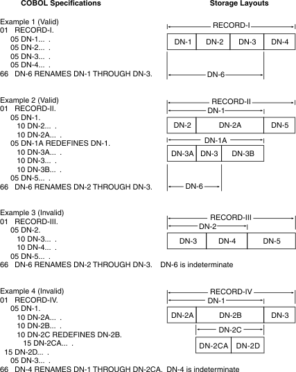

# Level Number 66 : RENAMES
給已存在的欄位取另一個名稱或創建別名範圍。

<br>

## 使用情境
- 資料結構重複使用，想用不同名稱訪問同一段資料。
- 方便程式中不同語意下使用同一記錄。

### 範例
```cobol
01 EMPLOYEE-RECORD.
   05 EMP-NAME        PIC X(20).
   05 EMP-AGE         PIC 99.
   05 EMP-ADDRESS     PIC X(30).

66 EMP-PERSONAL-INFO RENAMES EMP-NAME THRU EMP-AGE.

```

> EMP-PERSONAL-INFO 可以直接引用 EMP-NAME 和 EMP-AGE，就像一個新的群組。

<br>

## 支援說明



在 IBM 提供的 [Figure description: RENAMES clause specifications](https://www.ibm.com/docs/en/cobol-linux-x86/1.2.0?topic=SS7FZ2_1.2.0/lr/ref/rlimg1017.htm) 說明中，整理出 `RENAMES` 合法與非法的使用規則，這邊只討論合法規則的支援性：

<br>

**Example 1**：連續欄位重新命名
```cobol
01	RECORD-I
	05	DN-1... .
	05	DN-2... .
	05	DN-3... .
	05	DN-4... .
66	DN-6 RENAMES DN-1 THROUGH DN-3.

```
`DN-6` 重新命名的範圍為 `DN-1`、`DN-2`、`DN-3`。

<br>

**Example 2**：巢狀欄位重新命名
```cobol
01	RECORD-II
	05	DN-1.
		10	DN-2... .
		10	DN-2A... .
	05	DN-1A REDEFINES DN-1.
		10	DN-3A... .
		10	DN-3... .
		10	DN-3B... .
	05	DN-5... .
66	DN-6 RENAMES DN-2 THROUGH DN-3.

```
因為 `DN-2` 為 `DN-1` 的開頭位置， `DN-1A` 因 `REDEFINES` 與 `DN-1` 在記憶體上共用 `RECORD-II` 的起始點。所以實際上還是從 `RECORD-II` 的起始點取到 `DN-3`。  
這時候 `DN-6` 實際重新命名的範圍是 `DN-3A`、`DN-3` ，而 `DN-2` 可能有值， `DN-2A` 有可能會取到破碎的資料。 (會有類似指標 overflow 的問題)

<br>

### 支援狀態總覽

| Example   | 用法說明                     | 支援狀態  | 說明                                         |
| --------- | ---------------------------- | ----- | ------------------------------------------ |
| Example 1 | 連續欄位重新命名      | ✅ 支援  | 最常見且結構單純的用法， RENAMES 只是另一種結構化視角。 |
| Example 2 | 巢狀欄位 + REDEFINES + RENAMES   | ❌ 不支援 | 涉及記憶體映射，範圍計算複雜，故不在支援範圍。                  |

<br><br>

# 參考

IBM COBOL for Linux on x86 (1.2.0) : [RENAMES clause](https://www.ibm.com/docs/en/cobol-linux-x86/1.2.0?topic=entry-renames-clause)  
